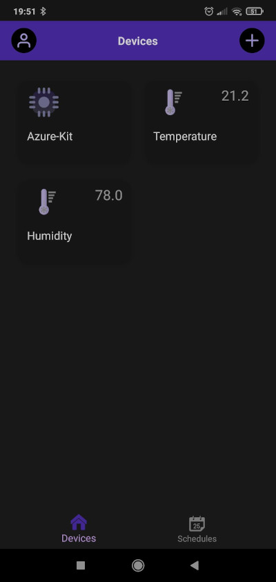
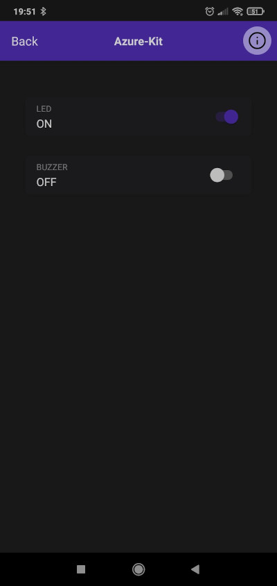

# BSP Rainmaker Example

This example shows how to use the Rainmaker to collect data about temperature, humidity as well as control the LED (Azure LED) and the buzzer.

In this example, we use the temperature and humidity sensor HTS221. The OLED screen is used to show the data.

## Build and Flash firmware

### Rainmaker

Please clone this repository alongside the ESP-IDF.

```
git clone --recursive https://github.com/espressif/esp-rainmaker.git
```

> Note the --recursive option. This is required to pull in the various dependencies into esp-rainmaker. In case you have already cloned the repository without this option, execute this to pull in the submodules: `git submodule update --init --recursive`

Check the ESP RainMaker documentation [here](https://rainmaker.espressif.com/docs/get-started.html) to get started.

### Build and Flash

Build the project and flash it to the board, then run the monitor tool to view the serial output:

Run `idf.py -p PORT flash monitor` to build, flash and monitor the project.

(To exit the serial monitor, type ``Ctrl-]``.)

### Mobile Application

In order to use Rainmaker, you need to install the aplication in your mobile phone. Our applications are available to both Android and iPhone.

ESP RainMaker for Android: [Download](https://play.google.com/store/apps/details?id=com.espressif.rainmaker)
ESP RainMaker for iPhone [Download](https://apps.apple.com/us/app/esp-rainmaker/id1497491540)

Create a new account and start the provisioning by adding a new device to your account.

## What to expect in this example?

In the mobile application, you will see the device data and controls.




### Reset to Factory

Press and hold the `KEY_IO0` button for more than 3 seconds to reset the board to factory defaults. You will have to provision the board again to use it.
